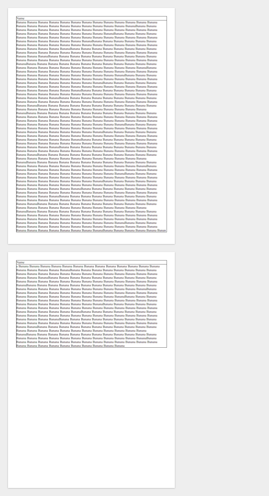
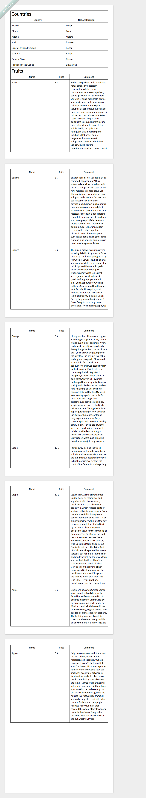
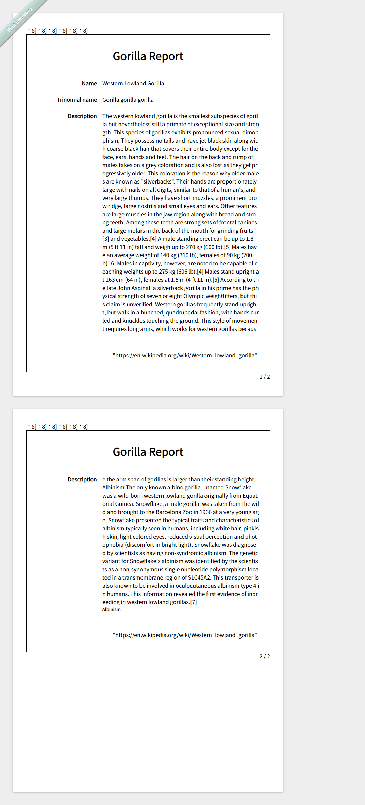
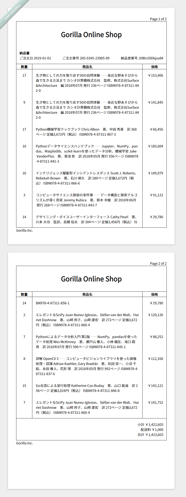
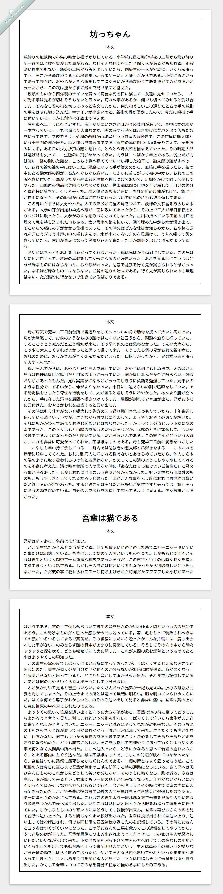

# browser-report

Browser based reporting engine aka HTML 帳票 (HTML + CSS + JavaScript).

We can't control browser's page breaking when contents overflowed. So this library splits overflowed contents and breaks the page on DOM tree.

[Demo page](https://caramelopardalis.github.io/browser-report).

## Examples

### Example 1

[Demo](example1/example1.html)

#### Screenshot



```html
<!DOCTYPE html>
<html>
    <head>
        <link rel="stylesheet" href="../browser-report.css">
        <link rel="stylesheet" href="https://cdnjs.cloudflare.com/ajax/libs/github-fork-ribbon-css/0.2.2/gh-fork-ribbon.min.css">
        <style>
            h1 {
                padding-left: 2mm;
            }

            .br-grid-header {
                padding: .5em;
                text-align: center;
                font-weight: bold;
            }
            .br-grid-data {
                padding: .5em;
                padding-bottom: 1em;
            }

            .countries .br-grid-data {
                padding-bottom: .5em;
            }
            .country-name {
                flex-grow: 1;
            }
            .national-capital-name {
                min-width: 300px;
            }

            .fruit-name {
                min-width: 300px;
            }
            .fruit-price {
                min-width: 100px;
            }
            .fruit-comment {
                flex-grow: 1;
            }

            .github-fork-ribbon:before {
                background-color: #cce5df;
            }
            @media print {
                .github-fork-ribbon {
                    display: none;
                }
            }
        </style>
    </head>
    <body class="br-a4-portrait">
        <div class="br-content">
            <h1>Countries</h1>
            <div class="br-group countries">
                <div class="br-grid br-bordered">
                    <div class="br-grid-header country-name">Country</div>
                    <div class="br-grid-header national-capital-name">National Capital</div>
                </div>
                <div class="br-group br-grid br-bordered">
                    <div class="br-grid-data country-name">Nigeria</div>
                    <div class="br-grid-data national-capital-name">Abuja</div>
                </div>
                <div class="br-group br-grid br-bordered">
                    <div class="br-grid-data country-name">Ghana</div>
                    <div class="br-grid-data national-capital-name">Accra</div>
                </div>
                <div class="br-group br-grid br-bordered">
                    <div class="br-grid-data country-name">Algeria</div>
                    <div class="br-grid-data national-capital-name">Algiers</div>
                </div>
                <div class="br-group br-grid br-bordered">
                    <div class="br-grid-data country-name">Mali</div>
                    <div class="br-grid-data national-capital-name">Bamako</div>
                </div>
                <div class="br-group br-grid br-bordered">
                    <div class="br-grid-data country-name">Central African Republic</div>
                    <div class="br-grid-data national-capital-name">Bangui</div>
                </div>
                <div class="br-group br-grid br-bordered">
                    <div class="br-grid-data country-name">Gambia</div>
                    <div class="br-grid-data national-capital-name">Banjul</div>
                </div>
                <div class="br-group br-grid br-bordered">
                    <div class="br-grid-data country-name">Guinea-Bissau</div>
                    <div class="br-grid-data national-capital-name">Bissau</div>
                </div>
                <div class="br-group br-grid br-bordered">
                    <div class="br-grid-data country-name">Republic of the Congo</div>
                    <div class="br-grid-data national-capital-name">Brazzaville</div>
                </div>
            </div>
            <h1>Fruits</h1>
            <div class="br-group fruits">
                <div class="br-grid br-bordered">
                    <div class="br-grid-header fruit-name">Name</div>
                    <div class="br-grid-header fruit-price">Price</div>
                    <div class="br-grid-header fruit-comment">Comment</div>
                </div>
                <div class="br-group br-grid br-bordered">
                    <div class="br-grid-data fruit-name">Banana</div>
                    <div class="br-grid-data fruit-price">3 $</div>
                    <div class="br-grid-data fruit-comment">Sed ut perspiciatis unde omnis iste natus error sit voluptatem accusantium doloremque laudantium, totam rem aperiam, eaque ipsa quae ab illo inventore veritatis et quasi architecto beatae vitae dicta sunt explicabo. Nemo enim ipsam voluptatem quia voluptas sit aspernatur aut odit aut fugit, sed quia consequuntur magni dolores eos qui ratione voluptatem sequi nesciunt. Neque porro quisquam est, qui dolorem ipsum quia dolor sit amet, consectetur, adipisci velit, sed quia non numquam eius modi tempora incidunt ut labore et dolore magnam aliquam quaerat voluptatem. Ut enim ad minima veniam, quis nostrum exercitationem ullam corporis suscipit laboriosam, nisi ut aliquid ex ea commodi consequatur? Quis autem vel eum iure reprehenderit qui in ea voluptate velit esse quam nihil molestiae consequatur, vel illum qui dolorem eum fugiat quo voluptas nulla pariatur? At vero eos et accusamus et iusto odio dignissimos ducimus qui blanditiis praesentium voluptatum deleniti atque corrupti quos dolores et quas molestias excepturi sint occaecati cupiditate non provident, similique sunt in culpa qui officia deserunt mollitia animi, id est laborum et dolorum fuga. Et harum quidem rerum facilis est et expedita distinctio. Nam libero tempore, cum soluta nobis est eligendi optio cumque nihil impedit quo minus id quod maxime placeat facere </div>
                </div>
                <div class="br-group br-grid br-bordered">
                    <div class="br-grid-data fruit-name">Orange</div>
                    <div class="br-grid-data fruit-price">5 $</div>
                    <div class="br-grid-data fruit-comment">Lorem ipsum dolor sit amet, consectetur adipisicing elit, sed do eiusmod tempor incididunt ut labore et dolore magna aliqua. Ut enim ad minim veniam, quis nostrud exercitation ullamco laboris nisi ut aliquip ex ea commodo consequat. Duis aute irure dolor in reprehenderit in voluptate velit esse cillum dolore eu fugiat nulla pariatur. Excepteur sint occaecat cupidatat non proident, sunt in culpa qui officia deserunt mollit anim id est laborum. Lorem ipsum dolor sit amet, consectetur adipisicing elit, sed do eiusmod tempor incididunt ut labore et dolore magna aliqua. Ut enim ad minim veniam, quis nostrud exercitation ullamco laboris nisi ut aliquip ex ea commodo consequat. Duis aute irure dolor in reprehenderit in voluptate velit esse cillum dolore eu fugiat nulla pariatur. Excepteur sint occaecat cupidatat non proident, sunt in culpa qui officia deserunt mollit anim id est laborum. Lorem ipsum dolor sit amet, consectetur adipisicing elit, sed do eiusmod tempor incididunt ut labore et dolore magna aliqua. Ut enim ad minim veniam, quis nostrud exercitation ullamco laboris nisi ut aliquip ex ea commodo consequat. Duis aute irure dolor in reprehenderit in voluptate velit esse cillum dolore eu fugiat nulla pariatur. Excepteur sint occaecat cupidatat non proident, sunt in culpa qui officia deserunt mollit anim id est laborum. Lorem ipsum dolor sit amet, consectetur adipisicing elit, sed do eiusmod tempor incididunt ut labore et dolore magna aliqua. Ut enim ad minim veniam, quis nostrud exercitation ullamco laboris nisi ut aliquip ex ea commodo consequat. Duis aute irure dolor in reprehenderit in voluptate velit esse cillum dolore eu fugiat nulla pariatur. Excepteur sint occaecat cupidatat non proident, sunt in culpa qui officia deserunt mollit anim id est laborum. Lorem ipsum dolor sit amet, consectetur adipisicing elit, sed do eiusmod tempor incididunt ut labore et dolore magna aliqua. Ut enim ad minim veniam, quis nostrud exercitation ullamco laboris nisi ut aliquip ex ea commodo consequat. Duis aute irure dolor in reprehenderit in voluptate velit esse cillum dolore eu fugiat nulla pariatur. Excepteur sint occaecat cupidatat non proident, sunt in culpa qui officia deserunt mollit anim id est laborum. Lorem ipsum dolor sit amet, consectetur adipisicing elit, sed do eiusmod tempor incididunt ut labore et dolore magna aliqua. Ut enim ad minim veniam, quis nostrud exercitation ullamco laboris nisi ut aliquip ex ea commodo consequat. Duis aute irure dolor in reprehenderit in voluptate velit esse cillum dolore eu fugiat nulla pariatur. Excepteur sint occaecat cupidatat non proident, sunt in culpa qui officia deserunt mollit anim id est laborum. Lorem ipsum dolor sit amet, consectetur adipisicing elit, sed do eiusmod tempor incididunt ut labore et dolore magna aliqua. Ut enim ad minim veniam, quis nostrud exercitation ullamco laboris nisi ut aliquip ex ea commodo consequat. Duis aute irure dolor in reprehenderit in voluptate velit esse cillum dolore eu fugiat nulla pariatur. Excepteur sint occaecat cupidatat non proident, sunt in culpa qui officia deserunt mollit anim id est laborum. Lorem ipsum dolor sit amet, consectetur adipisicing elit, sed do eiusmod tempor incididunt ut labore et dolore magna aliqua. Ut enim ad minim veniam, quis nostrud exercitation ullamco laboris nisi ut aliquip ex ea commodo consequat. Duis aute irure dolor in reprehenderit in voluptate velit esse cillum dolore eu fugiat nulla pariatur. Excepteur sint occaecat cupidatat non proident, sunt in culpa qui officia deserunt mollit anim id est laborum. Lorem ipsum dolor sit amet, consectetur adipisicing elit, sed do eiusmod tempor incididunt ut labore et dolore magna aliqua. Ut enim ad minim veniam, quis nostrud exercitation ullamco laboris nisi ut aliquip ex ea commodo consequat. Duis aute irure dolor in reprehenderit in voluptate velit esse cillum dolore eu fugiat nulla pariatur. Excepteur sint occaecat cupidatat non proident, sunt in culpa qui officia deserunt mollit anim id est laborum. Lorem ipsum dolor sit amet, consectetur adipisicing elit, sed do eiusmod tempor incididunt ut labore et dolore magna aliqua. Ut enim ad minim veniam, quis nostrud exercitation ullamco laboris nisi ut aliquip ex ea commodo consequat. Duis aute irure dolor in reprehenderit in voluptate velit esse cillum dolore eu fugiat nulla pariatur. Excepteur sint occaecat cupidatat non proident, sunt in culpa qui officia deserunt mollit anim id est laborum. Lorem ipsum dolor sit amet, consectetur adipisicing elit, sed do eiusmod tempor incididunt ut labore et dolore magna aliqua. Ut enim ad minim veniam, quis nostrud exercitation ullamco laboris nisi ut aliquip ex ea commodo consequat. Duis aute irure dolor in reprehenderit in voluptate velit esse cillum dolore eu fugiat nulla pariatur. Excepteur sint occaecat cupidatat non proident, sunt in culpa qui officia deserunt mollit anim id est laborum. Lorem ipsum dolor sit amet, consectetur adipisicing elit, sed do eiusmod tempor incididunt ut labore et dolore magna aliqua. Ut enim ad minim veniam, quis nostrud exercitation ullamco laboris nisi ut aliquip ex ea commodo consequat. Duis aute irure dolor in reprehenderit in voluptate velit esse cillum dolore eu fugiat nulla pariatur. Excepteur sint occaecat cupidatat non proident, sunt in culpa qui officia deserunt mollit anim id est laborum. Lorem ipsum dolor sit amet, consectetur adipisicing elit, sed do eiusmod tempor incididunt ut labore et dolore magna aliqua. Ut enim ad minim veniam, quis nostrud exercitation ullamco laboris nisi ut aliquip ex ea commodo consequat. Duis aute irure dolor in reprehenderit in voluptate velit esse cillum dolore eu fugiat nulla pariatur. Excepteur sint occaecat cupidatat non proident, sunt in culpa qui officia deserunt mollit anim id est laborum. Lorem ipsum dolor sit amet, consectetur adipisicing elit, sed do eiusmod tempor incididunt ut labore et dolore magna aliqua. Ut enim ad minim veniam, quis nostrud exercitation ullamco laboris nisi ut aliquip ex ea commodo consequat. Duis aute irure dolor in reprehenderit in voluptate velit esse cillum dolore eu fugiat nulla pariatur. Excepteur sint occaecat cupidatat non proident, sunt in culpa qui officia deserunt mollit anim id est laborum. Lorem ipsum dolor sit amet, consectetur adipisicing elit, sed do eiusmod tempor incididunt ut labore et dolore magna aliqua. Ut enim ad minim veniam, quis nostrud exercitation ullamco laboris nisi ut aliquip ex ea commodo consequat. Duis aute irure dolor in reprehenderit in voluptate velit esse cillum dolore eu fugiat nulla pariatur. Excepteur sint occaecat cupidatat non proident, sunt in culpa qui officia deserunt mollit anim id est laborum. Lorem ipsum dolor sit amet, consectetur adipisicing elit, sed do eiusmod tempor incididunt ut labore et dolore magna aliqua. Ut enim ad minim veniam, quis nostrud exercitation ullamco laboris nisi ut aliquip ex ea commodo consequat. Duis aute irure dolor in reprehenderit in voluptate velit esse cillum dolore eu fugiat nulla pariatur. Excepteur sint occaecat cupidatat non proident, sunt in culpa qui officia deserunt mollit anim id est laborum. Lorem ipsum dolor sit amet, consectetur adipisicing elit, sed do eiusmod tempor incididunt ut labore et dolore magna aliqua. Ut enim ad minim veniam, quis nostrud exercitation ullamco laboris nisi ut aliquip ex ea commodo consequat. Duis aute irure dolor in reprehenderit in voluptate velit esse cillum dolore eu fugiat nulla pariatur. Excepteur sint occaecat cupidatat non proident, sunt in culpa qui officia deserunt mollit anim id est laborum. Lorem ipsum dolor sit amet, consectetur adipisicing elit, sed do eiusmod tempor incididunt ut labore et dolore magna aliqua. Ut enim ad minim veniam, quis nostrud exercitation ullamco laboris nisi ut aliquip ex ea commodo consequat. Duis aute irure dolor in reprehenderit in voluptate velit esse cillum dolore eu fugiat nulla pariatur. Excepteur sint occaecat cupidatat non proident, sunt in culpa qui officia deserunt mollit anim id est laborum. Lorem ipsum dolor sit amet, consectetur adipisicing elit, sed do eiusmod tempor incididunt ut labore et dolore magna aliqua. Ut enim ad minim veniam, quis nostrud exercitation ullamco laboris nisi ut aliquip ex ea commodo consequat. Duis aute irure dolor in reprehenderit in voluptate velit esse cillum dolore eu fugiat nulla pariatur. Excepteur sint occaecat cupidatat non proident, sunt in culpa qui officia deserunt mollit anim id est laborum. Lorem ipsum dolor sit amet, consectetur adipisicing elit, sed do eiusmod tempor incididunt ut labore et dolore magna aliqua. Ut enim ad minim veniam, quis nostrud exercitation ullamco laboris nisi ut aliquip ex ea commodo consequat. Duis aute irure dolor in reprehenderit in voluptate velit esse cillum dolore eu fugiat nulla pariatur. Excepteur sint occaecat cupidatat non proident, sunt in culpa qui officia deserunt mollit anim id est laborum. Lorem ipsum dolor sit amet, consectetur adipisicing elit, sed do eiusmod tempor incididunt ut labore et dolore magna aliqua. Ut enim ad minim veniam, quis nostrud exercitation ullamco laboris nisi ut aliquip ex ea commodo consequat. Duis aute irure dolor in reprehenderit in voluptate velit esse cillum dolore eu fugiat nulla pariatur. Excepteur sint occaecat cupidatat non proident, sunt in culpa qui officia deserunt mollit anim id est laborum. Lorem ipsum dolor sit amet, consectetur adipisicing elit, sed do eiusmod tempor incididunt ut labore et dolore magna aliqua. Ut enim ad minim veniam, quis nostrud exercitation ullamco laboris nisi ut aliquip ex ea commodo consequat. Duis aute irure dolor in reprehenderit in voluptate velit esse cillum dolore eu fugiat nulla pariatur. Excepteur sint occaecat cupidatat non proident, sunt in culpa qui officia deserunt mollit anim id est laborum. Lorem ipsum dolor sit amet, consectetur adipisicing elit, sed do eiusmod tempor incididunt ut labore et dolore magna aliqua. Ut enim ad minim veniam, quis nostrud exercitation ullamco laboris nisi ut aliquip ex ea commodo consequat. Duis aute irure dolor in reprehenderit in voluptate velit esse cillum dolore eu fugiat nulla pariatur. Excepteur sint occaecat cupidatat non proident, sunt in culpa qui officia deserunt mollit anim id est laborum. Lorem ipsum dolor sit amet, consectetur adipisicing elit, sed do eiusmod tempor incididunt ut labore et dolore magna aliqua. Ut enim ad minim veniam, quis nostrud exercitation ullamco laboris nisi ut aliquip ex ea commodo consequat. Duis aute irure dolor in reprehenderit in voluptate velit esse cillum dolore eu fugiat nulla pariatur. Excepteur sint occaecat cupidatat non proident, sunt in culpa qui officia deserunt mollit anim id est laborum.</div>
                </div>
                <div class="br-group br-grid br-bordered">
                    <div class="br-grid-data fruit-name">Grape</div>
                    <div class="br-grid-data fruit-price">12 $</div>
                    <div class="br-grid-data fruit-comment">Far far away, behind the word mountains, far from the countries Vokalia and Consonantia, there live the blind texts. Separated they live in Bookmarksgrove right at the coast of the Semantics, a large language ocean. A small river named Duden flows by their place and supplies it with the necessary regelialia. It is a paradisematic country, in which roasted parts of sentences fly into your mouth. Even the all-powerful Pointing has no control about the blind texts it is an almost unorthographic life One day however a small line of blind text by the name of Lorem Ipsum decided to leave for the far World of Grammar. The Big Oxmox advised her not to do so, because there were thousands of bad Commas, wild Question Marks and devious Semikoli, but the Little Blind Text didn’t listen. She packed her seven versalia, put her initial into the belt and made herself on the way. When she reached the first hills of the Italic Mountains, she had a last view back on the skyline of her hometown Bookmarksgrove, the headline of Alphabet Village and the subline of her own road, the Line Lane. Pityful a rethoric question ran over her cheek, then </div>
                </div>
                <div class="br-group br-grid br-bordered">
                    <div class="br-grid-data fruit-name">Apple</div>
                    <div class="br-grid-data fruit-price">6 $</div>
                    <div class="br-grid-data fruit-comment">Lorem ipsum dolor sit amet, consectetur adipisicing elit, sed do eiusmod tempor incididunt ut labore et dolore magna aliqua. Ut enim ad minim veniam, quis nostrud exercitation ullamco laboris nisi ut aliquip ex ea commodo consequat. Duis aute irure dolor in reprehenderit in voluptate velit esse cillum dolore eu fugiat nulla pariatur. Excepteur sint occaecat cupidatat non proident, sunt in culpa qui officia deserunt mollit anim id est laborum. Lorem ipsum dolor sit amet, consectetur adipisicing elit, sed do eiusmod tempor incididunt ut labore et dolore magna aliqua. Ut enim ad minim veniam, quis nostrud exercitation ullamco laboris nisi ut aliquip ex ea commodo consequat. Duis aute irure dolor in reprehenderit in voluptate velit esse cillum dolore eu fugiat nulla pariatur. Excepteur sint occaecat cupidatat non proident, sunt in culpa qui officia deserunt mollit anim id est laborum. Lorem ipsum dolor sit amet, consectetur adipisicing elit, sed do eiusmod tempor incididunt ut labore et dolore magna aliqua. Ut enim ad minim veniam, quis nostrud exercitation ullamco laboris nisi ut aliquip ex ea commodo consequat. Duis aute irure dolor in reprehenderit in voluptate velit esse cillum dolore eu fugiat nulla pariatur. Excepteur sint occaecat cupidatat non proident, sunt in culpa qui officia deserunt mollit anim id est laborum. Lorem ipsum dolor sit amet, consectetur adipisicing elit, sed do eiusmod tempor incididunt ut labore et dolore magna aliqua. Ut enim ad minim veniam, quis nostrud exercitation ullamco laboris nisi ut aliquip ex ea commodo consequat. Duis aute irure dolor in reprehenderit in voluptate velit esse cillum dolore eu fugiat nulla pariatur. Excepteur sint occaecat cupidatat non proident, sunt in culpa qui officia deserunt mollit anim id est laborum. Lorem ipsum dolor sit amet, consectetur adipisicing elit, sed do eiusmod tempor incididunt ut labore et dolore magna aliqua. Ut enim ad minim veniam, quis nostrud exercitation ullamco laboris nisi ut aliquip ex ea commodo consequat. Duis aute irure dolor in reprehenderit in voluptate velit esse cillum dolore eu fugiat nulla pariatur. Excepteur sint occaecat cupidatat non proident, sunt in culpa qui officia deserunt mollit anim id est laborum. Lorem ipsum dolor sit amet, consectetur adipisicing elit, sed do eiusmod tempor incididunt ut labore et dolore magna aliqua. Ut enim ad minim veniam, quis nostrud exercitation ullamco laboris nisi ut aliquip ex ea commodo consequat. Duis aute irure dolor in reprehenderit in voluptate velit esse cillum dolore eu fugiat nulla pariatur. Excepteur sint occaecat cupidatat non proident, sunt in culpa qui officia deserunt mollit anim id est laborum. Lorem ipsum dolor sit amet, consectetur adipisicing elit, sed do eiusmod tempor incididunt ut labore et dolore magna aliqua. Ut enim ad minim veniam, quis nostrud exercitation ullamco laboris nisi ut aliquip ex ea commodo consequat. Duis aute irure dolor in reprehenderit in voluptate velit esse cillum dolore eu fugiat nulla pariatur. Excepteur sint occaecat cupidatat non proident, sunt in culpa qui officia deserunt mollit anim id est laborum. Lorem ipsum dolor sit amet, consectetur adipisicing elit, sed do eiusmod tempor incididunt ut labore et dolore magna aliqua. Ut enim ad minim veniam, quis nostrud exercitation ullamco laboris nisi ut aliquip ex ea commodo consequat. Duis aute irure dolor in reprehenderit in voluptate velit esse cillum dolore eu fugiat nulla pariatur. Excepteur sint occaecat cupidatat non proident, sunt in culpa qui officia deserunt mollit anim id est laborum.</div>
                </div>
            </div>
        </div>
        <a class="github-fork-ribbon left-top" data-ribbon="Print Emulating" title="Print Emulating">Print Emulating</a>
        <script src="../browser-report.js"></script>
    </body>
</html>
```

### Example 2

[Demo](example2/example2.html)

#### Screenshot



```html
<!DOCTYPE html>
<html>
    <head>
        <link rel="stylesheet" href="../browser-report.css">
        <link rel="stylesheet" href="https://cdnjs.cloudflare.com/ajax/libs/github-fork-ribbon-css/0.2.2/gh-fork-ribbon.min.css">
        <style>
            h1 {
                padding-top: 10mm;
                padding-bottom: 10mm;
                text-align: center;
            }

            .br-grid-header {
                padding: .5em;
                text-align: right;
                font-weight: bold;
            }
            .br-grid-data {
                padding: .5em;
                padding-right: 2em;
                padding-bottom: 1em;
            }

            .fruit-name.br-grid-header {
                min-width: 200px;
                max-width: 200px;
            }
            .fruit-name {
                flex-grow: 1;
            }
            .fruit-price.br-grid-header {
                min-width: 200px;
                max-width: 200px;
            }
            .fruit-price {
                flex-grow: 1;
            }
            .fruit-comment.br-grid-header {
                min-width: 200px;
                max-width: 200px;
            }
            .fruit-comment {
                flex-grow: 1;
            }
            .edit-date {
                min-width: 100px;
                max-width: 100px;
            }

            .github-fork-ribbon:before {
                background-color: #cce5df;
            }
            @media print {
                .github-fork-ribbon {
                    display: none;
                }
            }
        </style>
    </head>
    <body class="br-a4-portrait">
        <div class="br-content">
            <h1>Banana Report</h1>
            <div class="br-group fruits">
                <div class="br-group br-grid">
                    <div class="br-grid-header fruit-name">Name</div>
                    <div class="br-grid-data fruit-name">Banana</div>
                    <div class="br-grid-data edit-date">2018-12-22</div>
                </div>
                <div class="br-group br-grid">
                    <div class="br-grid-header fruit-price">Price</div>
                    <div class="br-grid-data fruit-price">3 $</div>
                    <div class="br-grid-data edit-date">2018-12-24</div>
                </div>
                <div class="br-group br-grid">
                    <div class="br-grid-header fruit-comment">Comment</div>
                    <div class="br-grid-data fruit-comment">Sed ut perspiciatis unde omnis iste natus error sit voluptatem accusantium doloremque laudantium, totam rem aperiam, eaque ipsa quae ab illo inventore veritatis et quasi architecto beatae vitae dicta sunt explicabo. Nemo enim ipsam voluptatem quia voluptas sit aspernatur aut odit aut fugit, sed quia consequuntur magni dolores eos qui ratione voluptatem sequi nesciunt. Neque porro quisquam est, qui dolorem ipsum quia dolor sit amet, consectetur, adipisci velit, sed quia non numquam eius modi tempora incidunt ut labore et dolore magnam aliquam quaerat voluptatem. Ut enim ad minima veniam, quis nostrum exercitationem ullam corporis suscipit laboriosam, nisi ut aliquid ex ea commodi consequatur? Quis autem vel eum iure reprehenderit qui in ea voluptate velit esse quam nihil molestiae consequatur, vel illum qui dolorem eum fugiat quo voluptas nulla pariatur? At vero eos et accusamus et iusto odio dignissimos ducimus qui blanditiis praesentium voluptatum deleniti atque corrupti quos dolores et quas molestias excepturi sint occaecati cupiditate non provident, similique sunt in culpa qui officia deserunt mollitia animi, id est laborum et dolorum fuga. Et harum quidem rerum facilis est et expedita distinctio. Nam libero tempore, cum soluta nobis est eligendi optio cumque nihil impedit quo minus id quod maxime placeat facere Sed ut perspiciatis unde omnis iste natus error sit voluptatem accusantium doloremque laudantium, totam rem aperiam, eaque ipsa quae ab illo inventore veritatis et quasi architecto beatae vitae dicta sunt explicabo. Nemo enim ipsam voluptatem quia voluptas sit aspernatur aut odit aut fugit, sed quia consequuntur magni dolores eos qui ratione voluptatem sequi nesciunt. Neque porro quisquam est, qui dolorem ipsum quia dolor sit amet, consectetur, adipisci velit, sed quia non numquam eius modi tempora incidunt ut labore et dolore magnam aliquam quaerat voluptatem. Ut enim ad minima veniam, quis nostrum exercitationem ullam corporis suscipit laboriosam, nisi ut aliquid ex ea commodi consequatur? Quis autem vel eum iure reprehenderit qui in ea voluptate velit esse quam nihil molestiae consequatur, vel illum qui dolorem eum fugiat quo voluptas nulla pariatur? At vero eos et accusamus et iusto odio dignissimos ducimus qui blanditiis praesentium voluptatum deleniti atque corrupti quos dolores et quas molestias excepturi sint occaecati cupiditate non provident, similique sunt in culpa qui officia deserunt mollitia animi, id est laborum et dolorum fuga. Et harum quidem rerum facilis est et expedita distinctio. Nam libero tempore, cum soluta nobis est eligendi optio cumque nihil impedit quo minus id quod maxime placeat facere Sed ut perspiciatis unde omnis iste natus error sit voluptatem accusantium doloremque laudantium, totam rem aperiam, eaque ipsa quae ab illo inventore veritatis et quasi architecto beatae vitae dicta sunt explicabo. Nemo enim ipsam voluptatem quia voluptas sit aspernatur aut odit aut fugit, sed quia consequuntur magni dolores eos qui ratione voluptatem sequi nesciunt. Neque porro quisquam est, qui dolorem ipsum quia dolor sit amet, consectetur, adipisci velit, sed quia non numquam eius modi tempora incidunt ut labore et dolore magnam aliquam quaerat voluptatem. Ut enim ad minima veniam, quis nostrum exercitationem ullam corporis suscipit laboriosam, nisi ut aliquid ex ea commodi consequatur? Quis autem vel eum iure reprehenderit qui in ea voluptate velit esse quam nihil molestiae consequatur, vel illum qui dolorem eum fugiat quo voluptas nulla pariatur? At vero eos et accusamus et iusto odio dignissimos ducimus qui blanditiis praesentium voluptatum deleniti atque corrupti quos dolores et quas molestias excepturi sint occaecati cupiditate non provident, similique sunt in culpa qui officia deserunt mollitia animi, id est laborum et dolorum fuga. Et harum quidem rerum facilis est et expedita distinctio. Nam libero tempore, cum soluta nobis est eligendi optio cumque nihil impedit quo minus id quod maxime placeat facere </div>
                    <div class="br-grid-data edit-date">2018-12-25</div>
                </div>
            </div>
        </div>
        <a class="github-fork-ribbon left-top" data-ribbon="Print Emulating" title="Print Emulating">Print Emulating</a> 
        <script src="../browser-report.js"></script>
    </body>
</html>
```

### Example 3

[Demo](example3/example3.html)

#### Screenshot



```html
<!DOCTYPE html>
<html>
    <head>
        <link rel="stylesheet" href="../browser-report.css">
        <link rel="stylesheet" href="https://cdnjs.cloudflare.com/ajax/libs/github-fork-ribbon-css/0.2.2/gh-fork-ribbon.min.css">
        <style>
            h1 {
                padding-top: 10mm;
                padding-bottom: 10mm;
                text-align: center;
            }
            .br-page-footer {
                padding-top: 10mm;
                padding-right: 10mm;
                padding-bottom: 10mm;
                text-align: right;
            }
            .page-numbers {
                text-align: right;
            }

            .br-grid-header {
                padding: .5em;
                min-width: 200px;
                max-width: 200px;
                text-align: right;
                font-weight: bold;
            }
            .br-grid-data {
                flex-grow: 1;
                padding: .5em;
                padding-right: 2em;
                padding-bottom: 1em;
            }

            .github-fork-ribbon:before {
                background-color: #cce5df;
            }
            @media print {
                .github-fork-ribbon {
                    display: none;
                }
            }
        </style>
    </head>
    <body class="br-a4-portrait">
        <div class="br-indicator-container">
            <div class="br-indicator"></div>
        </div>
        <div class="br-content">
            <div class="br-page-margin-top">
                ：8]：8]：8]：8]：8]：8]
            </div>
            <div class="br-page-header">
                <h1>Gorilla Report</h1>
            </div>
            <div class="br-group">
                <div class="br-group br-grid">
                    <div class="br-grid-header">Name</div>
                    <div class="br-grid-data">Western Lowland Gorilla</div>
                </div>
                <div class="br-group br-grid">
                    <div class="br-grid-header">Trinomial name</div>
                    <div class="br-grid-data">Gorilla gorilla gorilla</div>
                </div>
                <div class="br-group br-grid">
                    <div class="br-grid-header">Description</div>
                    <div class="br-grid-data">The western lowland gorilla is the smallest subspecies of gorilla but nevertheless still a primate of exceptional size and strength. This species of gorillas exhibits pronounced sexual dimorphism. They possess no tails and have jet black skin along with coarse black hair that covers their entire body except for the face, ears, hands and feet. The hair on the back and rump of males takes on a grey coloration and is also lost as they get progressively older. This coloration is the reason why older males are known as "silverbacks". Their hands are proportionately large with nails on all digits, similar to that of a human's, and very large thumbs. They have short muzzles, a prominent brow ridge, large nostrils and small eyes and ears. Other features are large muscles in the jaw region along with broad and strong teeth. Among these teeth are strong sets of frontal canines and large molars in the back of the mouth for grinding fruits[3] and vegetables.[4] A male standing erect can be up to 1.8 m (5 ft 11 in) tall and weigh up to 270 kg (600 lb).[5] Males have an average weight of 140 kg (310 lb), females of 90 kg (200 lb).[6] Males in captivity, however, are noted to be capable of reaching weights up to 275 kg (606 lb).[4] Males stand upright at 163 cm (64 in), females at 1.5 m (4 ft 11 in).[5] According to the late John Aspinall a silverback gorilla in his prime has the physical strength of seven or eight Olympic weightlifters, but this claim is unverified. Western gorillas frequently stand upright, but walk in a hunched, quadrupedal fashion, with hands curled and knuckles touching the ground. This style of movement requires long arms, which works for western gorillas because the arm span of gorillas is larger than their standing height. <h5>Albinism</h5> The only known albino gorilla – named Snowflake – was a wild-born western lowland gorilla originally from Equatorial Guinea. Snowflake, a male gorilla, was taken from the wild and brought to the Barcelona Zoo in 1966 at a very young age. Snowflake presented the typical traits and characteristics of albinism typically seen in humans, including white hair, pinkish skin, light colored eyes, reduced visual perception and photophobia (discomfort in bright light). Snowflake was diagnosed by scientists as having non-syndromic albinism. The genetic variant for Snowflake’s albinism was identified by the scientists as a non-synonymous single nucleotide polymorphism located in a transmembrane region of SLC45A2. This transporter is also known to be involved in oculocutaneous albinism type 4 in humans. This information revealed the first evidence of inbreeding in western lowland gorillas.[7]</div>
                </div>
            </div>
            <div class="br-page-footer">
                <q>https://en.wikipedia.org/wiki/Western_lowland_gorilla</q><br>
            </div>
            <div class="br-page-margin-bottom">
                <div class="page-numbers">
                    <span class="br-page-number"></span> / <span class="br-total-number"></span>
                </div>
            </div>
        </div>
        <a class="github-fork-ribbon left-top" data-ribbon="Print Emulating" title="Print Emulating">Print Emulating</a> 
        <script src="../browser-report.js"></script>
    </body>
</html>
```

### Example 4

[Demo](example4/example4.html)

#### Screenshot



```html
<!DOCTYPE html>
<html>
    <head>
        <meta charset="utf-8">
        <link rel="stylesheet" href="../browser-report.css">
        <link rel="stylesheet" href="https://cdnjs.cloudflare.com/ajax/libs/github-fork-ribbon-css/0.2.2/gh-fork-ribbon.min.css">
        <style>
            h1 {
                padding-top: 10mm;
                padding-bottom: 10mm;
                text-align: center;
            }
            .page-numbers {
                text-align: right;
            }

            header {
                padding: 1rem;
            }
            h2 {
                font-size: 1rem;
            }
            .header-meta {
                display: flex;
                justify-content: space-between;
            }

            .br-grid-header.field-quantity
            ,.br-grid-header.field-name
            ,.br-grid-header.field-price {
                font-weight: bold;
                text-align: center;
            }
            .br-grid-data.field-quantity
            ,.br-grid-data.field-name
            ,.br-grid-data.field-price {
                border-bottom: none !important;
                padding: 1rem;
                white-space: pre-wrap;
            }
            .br-grid-data.field-quantity {
                text-align: center;
            }
            .br-grid-data.field-price {
                text-align: right;
            }

            :root {
                --field-quantity-width: 20mm;
                --field-price-width: 30mm;
            }
            .br-grid-header.field-quantity {
                min-width: var(--field-quantity-width);
                max-width: var(--field-quantity-width);
            }
            .br-grid-data.field-quantity {
                min-width: calc(var(--field-quantity-width) - (1rem * 2));
                max-width: calc(var(--field-quantity-width) - (1rem * 2));
            }
            .field-name {
                min-width: calc(var(--a4-x) - (var(--print-default-margin) * 2) - var(--field-quantity-width) - var(--field-price-width) - 4px);
                max-width: calc(var(--a4-x) - (var(--print-default-margin) * 2) - var(--field-quantity-width) - var(--field-price-width) - 4px);
            }
            .br-grid-data.field-name {
                min-width: calc(var(--a4-x) - (var(--print-default-margin) * 2) - var(--field-quantity-width) - var(--field-price-width) - (1rem * 2) - 4px);
                max-width: calc(var(--a4-x) - (var(--print-default-margin) * 2) - var(--field-quantity-width) - var(--field-price-width) - (1rem * 2) - 4px);
            }
            .br-grid-header.field-price {
                min-width: var(--field-price-width);
                max-width: var(--field-price-width);
            }
            .br-grid-data.field-price {
                min-width: calc(var(--field-price-width) - (1rem * 2));
                max-width: calc(var(--field-price-width) - (1rem * 2));
            }

            footer {
                display: flex;
                flex-flow: column nowrap;
                border-top: 1px solid #000;
                padding: 1rem;
            }
            .subtotal
            ,.delivery-charges
            ,.total {
                text-align: right;
            }

            .github-fork-ribbon:before {
                background-color: #cce5df;
            }
            @media print {
                .github-fork-ribbon {
                    display: none;
                }
            }
        </style>
    </head>
    <body class="br-a4-portrait">
        <div class="br-indicator-container">
            <div class="br-indicator"></div>
        </div>
        <div class="br-content">
            <div class="br-page-margin-top">
                <div class="page-numbers">
                    Page <span class="br-page-number"></span> of <span class="br-total-number"></span>
                </div>
            </div>
            <div class="br-page-header">
                <h1>Gorilla Online Shop</h1>
            </div>
            <header>
                <h2>納品書</h2>
                <div class="header-meta">
                    <div class="field-order-date">ご注文日 2019-01-01</div>
                    <div class="field-order-number">ご注文番号 205-0345-23985-09</div>
                    <div class="field-receipt-number">納品書番号 Ji9Bn20Dkjso84</div>
                </div>
            </header>
            <div class="br-group group-orders">
                <div class="br-grid br-bordered">
                    <div class="br-grid-header field-quantity">数量</div>
                    <div class="br-grid-header field-name">商品名</div>
                    <div class="br-grid-header field-price">価格</div>
                </div>
            </div>
            <footer>
                <div class="subtotal">小計 ￥${subtotal}</div>
                <div class="delivery-charges">配送料 ￥1,000</div>
                <div class="total">合計 ￥${total}</div>
            </footer>
            <div class="br-page-margin-bottom">
                Gorilla Inc.
            </div>
        </div>
        <a class="github-fork-ribbon left-top" data-ribbon="Print Emulating" title="Print Emulating">Print Emulating</a>
        <script>
            ;((global) => {
                const random = (min, max) => {
                    return Math.floor(Math.random() * (max - min + 1) + min)
                }

                const orders = document.getElementsByClassName('group-orders')[0]
                const numberOfOrders = random(0, 20)

                let subtotalValue = 0

                for (let i = 0; i < numberOfOrders; i++) {
                    const product = document.createElement('div')
                    product.classList.add('br-group')
                    product.classList.add('br-grid')
                    product.classList.add('br-bordered')
                    orders.appendChild(product)

                    const quantity = document.createElement('div')
                    quantity.classList.add('br-grid-data')
                    quantity.classList.add('field-quantity')
                    quantity.textContent = random(1, 20)
                    product.appendChild(quantity)

                    const name = document.createElement('div')
                    name.classList.add('br-grid-data')
                    name.classList.add('field-name')
                    name.textContent = [
                        '入門 監視 Mike Julian　著、松浦 隼人　訳 228ページ 定価3,024円（税込） ISBN978-4-87311-864-2',
                        'インテリジェンス駆動型インシデントレスポンス Scott J. Roberts、Rebekah Brown　著、石川 朝久　訳 280ページ 定価3,672円（税込） ISBN978-4-87311-866-6',
                        'Python機械学習クックブック Chris Albon　著、中田 秀基　訳 368ページ 定価3,672円（税込） ISBN978-4-87311-867-3',
                        '初めてのProcessing 第2版 Daniel Shiffman　著、尼岡 利崇　訳 592ページ 定価3,996円（税込） ISBN978-4-87311-861-1',
                        'デザイニング・ボイスユーザーインターフェース Cathy Pearl　著、川本 大功　監訳、高橋 信夫　訳 304ページ 定価3,456円（税込） ISBN978-4-87311-858-1',
                        '家庭の低温調理 Lisa Q. Fetterman、Meesha Halm、Scott Peabody　著、水原 文　訳 292ページ 定価3,456円（税込） ISBN978-4-87311-862-8',
                        'バイオビルダー Natalie Kuldell、Rachel Bernstein、Karen Ingram、Kathryn M. Hart　著、津田 和俊　監訳、片野 晃輔、西原 由実、濱田 格雄　訳 260ページ 定価2,592円（税込） ISBN978-4-87311-833-8',
                        'エレガントなSciPy Juan Nunez-Iglesias、Stéfan van der Walt、Harriet Dashnow　著、山崎 邦子、山崎 康宏　訳 272ページ 定価3,672円（税込） ISBN978-4-87311-860-4',
                        'Go言語による並行処理 Katherine Cox-Buday　著、山口 能迪　訳 256ページ 定価3,024円（税込） ISBN978-4-87311-846-8',
                        'Pythonによるデータ分析入門 第2版 ――NumPy、pandasを使ったデータ処理 Wes McKinney　著、瀬戸山 雅人、小林 儀匡、滝口 開資　訳 2018年07月 発行 596ページ ISBN978-4-87311-845-1',
                        '実践 パケット解析 第3版 ――Wiresharkを使ったトラブルシューティング Chris Sanders　著、髙橋 基信、宮本 久仁男　監訳、岡 真由美　訳 2018年06月 発行 424ページ ISBN978-4-87311-844-4',
                        'コンピュータサイエンス探偵の事件簿 ――データ構造と探索アルゴリズムが導く真実 Jeremy Kubica　著、鈴木 幸敏　訳 2018年06月 発行 268ページ ISBN978-4-87311-843-7',
                        '生き物としての力を取り戻す50の自然体験 ――身近な野あそびから森で生きる方法まで カシオ計算機株式会社　監修、株式会社Surface&Architecture　編 2018年07月 発行 236ページ ISBN978-4-87311-842-0',
                        'Pythonデータサイエンスハンドブック ――Jupyter、NumPy、pandas、Matplotlib、scikit-learnを使ったデータ分析、機械学習 Jake VanderPlas　著、菊池 彰　訳 2018年05月 発行 556ページ ISBN978-4-87311-841-3',
                        '入門 Kubernetes Kelsey Hightower、Brendan Burns、Joe Beda　著、松浦 隼人　訳 2018年03月 発行 248ページ ISBN978-4-87311-840-6',
                        '退屈をぶっとばせ！ ――自分の世界を広げるために本気で遊ぶ Joshua Glenn、Elizabeth Foy Larsen　著、大網 拓真、渡辺 圭介　訳 2018年05月 発行 348ページ ISBN978-4-87311-839-0',
                        '実践 CSIRTプレイブック ――セキュリティ監視とインシデント対応の基本計画 Jeff Bollinger、Brandon Enright、Matthew Valites　著、飯島 卓也、小川 梢、柴田 亮、山田 正浩　監訳、谷崎 朋子　訳 2018年05月 発行 272ページ ISBN978-4-87311-838-3',
                        '詳解 OpenCV 3 ――コンピュータビジョンライブラリを使った画像処理・認識 Adrian Kaehler, Gary Bradski　著、松田 晃一、小沼 千絵、永田 雅人、花形 理　訳 2018年05月 発行 992ページ ISBN978-4-87311-837-6',
                        'ゼロから作るDeep Learning ❷ ――自然言語処理編 斎藤 康毅　著 2018年07月 発行 432ページ ISBN978-4-87311-836-9',
                        'Effective DevOps ――4本柱による持続可能な組織文化の育て方 Jennifer Davis、Ryn Daniels　著、吉羽 龍太郎　監訳、長尾 高弘　訳 2018年03月 発行 376ページ ISBN978-4-87311-835-2',
                    ][random(0, 19)]
                    product.appendChild(name)

                    const price = document.createElement('div')
                    price.classList.add('br-grid-data')
                    price.classList.add('field-price')
                    const priceValue = random(100, 200000)
                    subtotalValue += priceValue
                    price.textContent = '￥' + priceValue.toLocaleString()
                    product.appendChild(price)
                }

                const subtotal = document.getElementsByClassName('subtotal')[0]
                subtotal.textContent = subtotal.textContent.replace('${subtotal}', subtotalValue.toLocaleString())

                const total = document.getElementsByClassName('total')[0]
                total.textContent = total.textContent.replace('${total}', (subtotalValue + 1000).toLocaleString())
            })(this)
        </script>
        <script src="../browser-report.js"></script>
    </body>
</html>
```

### Example 5

[Demo](example5/example5.html)

#### Screenshot



```html
<!DOCTYPE html>
<html>
    <head>
        <link rel="stylesheet" href="../browser-report.css">
        <link rel="stylesheet" href="https://cdnjs.cloudflare.com/ajax/libs/github-fork-ribbon-css/0.2.2/gh-fork-ribbon.min.css">
        <style>
            h1 {
                margin-top: 2rem;
                text-align: center;
            }
            .br-grid-header {
                margin-top: 1rem;
                text-align: center;
                flex-grow: 1;
            }
            .body {
                margin: 1rem;
                white-space: pre-wrap;
            }

            .github-fork-ribbon:before {
                background-color: #cce5df;
            }
            @media print {
                .github-fork-ribbon {
                    display: none;
                }
            }
        </style>
    </head>
    <body class="br-a4-portrait">
        <div class="br-indicator-container">
            <div class="br-indicator"></div>
        </div>
        <div class="br-content">
            <h1>坊っちゃん</h1>
            <div class="br-group">
                <div class="br-grid">
                    <div class="br-grid-header">本文</div>
                </div>
                <div class="br-grid">
                    <div class="br-grid-data body">親譲りの無鉄砲で小供の時から損ばかりしている。小学校に居る時分学校の二階から飛び降りて一週間ほど腰を抜かした事がある。なぜそんな無闇をしたと聞く人があるかも知れぬ。別段深い理由でもない。新築の二階から首を出していたら、同級生の一人が冗談に、いくら威張っても、そこから飛び降りる事は出来まい。弱虫やーい。と囃したからである。小使に負ぶさって帰って来た時、おやじが大きな眼をして二階ぐらいから飛び降りて腰を抜かす奴があるかと云ったから、この次は抜かさずに飛んで見せますと答えた。
　親類のものから西洋製のナイフを貰って奇麗な刃を日に翳して、友達に見せていたら、一人が光る事は光るが切れそうもないと云った。切れぬ事があるか、何でも切ってみせると受け合った。そんなら君の指を切ってみろと注文したから、何だ指ぐらいこの通りだと右の手の親指の甲をはすに切り込んだ。幸ナイフが小さいのと、親指の骨が堅かったので、今だに親指は手に付いている。しかし創痕は死ぬまで消えぬ。
　庭を東へ二十歩に行き尽すと、南上がりにいささかばかりの菜園があって、真中に栗の木が一本立っている。これは命より大事な栗だ。実の熟する時分は起き抜けに背戸を出て落ちた奴を拾ってきて、学校で食う。菜園の西側が山城屋という質屋の庭続きで、この質屋に勘太郎という十三四の倅が居た。勘太郎は無論弱虫である。弱虫の癖に四つ目垣を乗りこえて、栗を盗みにくる。ある日の夕方折戸の蔭に隠れて、とうとう勘太郎を捕まえてやった。その時勘太郎は逃げ路を失って、一生懸命に飛びかかってきた。向うは二つばかり年上である。弱虫だが力は強い。鉢の開いた頭を、こっちの胸へ宛ててぐいぐい押した拍子に、勘太郎の頭がすべって、おれの袷の袖の中にはいった。邪魔になって手が使えぬから、無暗に手を振ったら、袖の中にある勘太郎の頭が、右左へぐらぐら靡いた。しまいに苦しがって袖の中から、おれの二の腕へ食い付いた。痛かったから勘太郎を垣根へ押しつけておいて、足搦をかけて向うへ倒してやった。山城屋の地面は菜園より六尺がた低い。勘太郎は四つ目垣を半分崩して、自分の領分へ真逆様に落ちて、ぐうと云った。勘太郎が落ちるときに、おれの袷の片袖がもげて、急に手が自由になった。その晩母が山城屋に詫びに行ったついでに袷の片袖も取り返して来た。
　この外いたずらは大分やった。大工の兼公と肴屋の角をつれて、茂作の人参畠をあらした事がある。人参の芽が出揃わぬ処へ藁が一面に敷いてあったから、その上で三人が半日相撲をとりつづけに取ったら、人参がみんな踏みつぶされてしまった。古川の持っている田圃の井戸を埋めて尻を持ち込まれた事もある。太い孟宗の節を抜いて、深く埋めた中から水が湧き出て、そこいらの稲にみずがかかる仕掛であった。その時分はどんな仕掛か知らぬから、石や棒ちぎれをぎゅうぎゅう井戸の中へ挿し込んで、水が出なくなったのを見届けて、うちへ帰って飯を食っていたら、古川が真赤になって怒鳴り込んで来た。たしか罰金を出して済んだようである。
　おやじはちっともおれを可愛がってくれなかった。母は兄ばかり贔屓にしていた。この兄はやに色が白くって、芝居の真似をして女形になるのが好きだった。おれを見る度にこいつはどうせ碌なものにはならないと、おやじが云った。乱暴で乱暴で行く先が案じられると母が云った。なるほど碌なものにはならない。ご覧の通りの始末である。行く先が案じられたのも無理はない。ただ懲役に行かないで生きているばかりである。
　母が病気で死ぬ二三日前台所で宙返りをしてへっついの角で肋骨を撲って大いに痛かった。母が大層怒って、お前のようなものの顔は見たくないと云うから、親類へ泊りに行っていた。するととうとう死んだと云う報知が来た。そう早く死ぬとは思わなかった。そんな大病なら、もう少し大人しくすればよかったと思って帰って来た。そうしたら例の兄がおれを親不孝だ、おれのために、おっかさんが早く死んだんだと云った。口惜しかったから、兄の横っ面を張って大変叱られた。
　母が死んでからは、おやじと兄と三人で暮していた。おやじは何にもせぬ男で、人の顔さえ見れば貴様は駄目だ駄目だと口癖のように云っていた。何が駄目なんだか今に分らない。妙なおやじがあったもんだ。兄は実業家になるとか云ってしきりに英語を勉強していた。元来女のような性分で、ずるいから、仲がよくなかった。十日に一遍ぐらいの割で喧嘩をしていた。ある時将棋をさしたら卑怯な待駒をして、人が困ると嬉しそうに冷やかした。あんまり腹が立ったから、手に在った飛車を眉間へ擲きつけてやった。眉間が割れて少々血が出た。兄がおやじに言付けた。おやじがおれを勘当すると言い出した。
　その時はもう仕方がないと観念して先方の云う通り勘当されるつもりでいたら、十年来召し使っている清という下女が、泣きながらおやじに詫まって、ようやくおやじの怒りが解けた。それにもかかわらずあまりおやじを怖いとは思わなかった。かえってこの清と云う下女に気の毒であった。この下女はもと由緒のあるものだったそうだが、瓦解のときに零落して、つい奉公までするようになったのだと聞いている。だから婆さんである。この婆さんがどういう因縁か、おれを非常に可愛がってくれた。不思議なものである。母も死ぬ三日前に愛想をつかした――おやじも年中持て余している――町内では乱暴者の悪太郎と爪弾きをする――このおれを無暗に珍重してくれた。おれは到底人に好かれる性でないとあきらめていたから、他人から木の端のように取り扱われるのは何とも思わない、かえってこの清のようにちやほやしてくれるのを不審に考えた。清は時々台所で人の居ない時に「あなたは真っ直でよいご気性だ」と賞める事が時々あった。しかしおれには清の云う意味が分からなかった。好い気性なら清以外のものも、もう少し善くしてくれるだろうと思った。清がこんな事を云う度におれはお世辞は嫌いだと答えるのが常であった。すると婆さんはそれだから好いご気性ですと云っては、嬉しそうにおれの顔を眺めている。自分の力でおれを製造して誇ってるように見える。少々気味がわるかった。</div>
                </div>
            </div>
            <h1>吾輩は猫である</h1>
            <div class="br-group">
                <div class="br-grid">
                    <div class="br-grid-header">本文</div>
                </div>
                <div class="br-grid">
                    <div class="br-grid-data body">吾輩は猫である。名前はまだ無い。
　どこで生れたかとんと見当がつかぬ。何でも薄暗いじめじめした所でニャーニャー泣いていた事だけは記憶している。吾輩はここで始めて人間というものを見た。しかもあとで聞くとそれは書生という人間中で一番獰悪な種族であったそうだ。この書生というのは時々我々を捕えて煮て食うという話である。しかしその当時は何という考もなかったから別段恐しいとも思わなかった。ただ彼の掌に載せられてスーと持ち上げられた時何だかフワフワした感じがあったばかりである。掌の上で少し落ちついて書生の顔を見たのがいわゆる人間というものの見始であろう。この時妙なものだと思った感じが今でも残っている。第一毛をもって装飾されべきはずの顔がつるつるしてまるで薬缶だ。その後猫にもだいぶ逢ったがこんな片輪には一度も出会わした事がない。のみならず顔の真中があまりに突起している。そうしてその穴の中から時々ぷうぷうと煙を吹く。どうも咽せぽくて実に弱った。これが人間の飲む煙草というものである事はようやくこの頃知った。
　この書生の掌の裏でしばらくはよい心持に坐っておったが、しばらくすると非常な速力で運転し始めた。書生が動くのか自分だけが動くのか分らないが無暗に眼が廻る。胸が悪くなる。到底助からないと思っていると、どさりと音がして眼から火が出た。それまでは記憶しているがあとは何の事やらいくら考え出そうとしても分らない。
　ふと気が付いて見ると書生はいない。たくさんおった兄弟が一疋も見えぬ。肝心の母親さえ姿を隠してしまった。その上今までの所とは違って無暗に明るい。眼を明いていられぬくらいだ。はてな何でも容子がおかしいと、のそのそ這い出して見ると非常に痛い。吾輩は藁の上から急に笹原の中へ棄てられたのである。
　ようやくの思いで笹原を這い出すと向うに大きな池がある。吾輩は池の前に坐ってどうしたらよかろうと考えて見た。別にこれという分別も出ない。しばらくして泣いたら書生がまた迎に来てくれるかと考え付いた。ニャー、ニャーと試みにやって見たが誰も来ない。そのうち池の上をさらさらと風が渡って日が暮れかかる。腹が非常に減って来た。泣きたくても声が出ない。仕方がない、何でもよいから食物のある所まであるこうと決心をしてそろりそろりと池を左りに廻り始めた。どうも非常に苦しい。そこを我慢して無理やりに這って行くとようやくの事で何となく人間臭い所へ出た。ここへ這入ったら、どうにかなると思って竹垣の崩れた穴から、とある邸内にもぐり込んだ。縁は不思議なもので、もしこの竹垣が破れていなかったなら、吾輩はついに路傍に餓死したかも知れんのである。一樹の蔭とはよく云ったものだ。この垣根の穴は今日に至るまで吾輩が隣家の三毛を訪問する時の通路になっている。さて邸へは忍び込んだもののこれから先どうして善いか分らない。そのうちに暗くなる、腹は減る、寒さは寒し、雨が降って来るという始末でもう一刻の猶予が出来なくなった。仕方がないからとにかく明るくて暖かそうな方へ方へとあるいて行く。今から考えるとその時はすでに家の内に這入っておったのだ。ここで吾輩は彼の書生以外の人間を再び見るべき機会に遭遇したのである。第一に逢ったのがおさんである。これは前の書生より一層乱暴な方で吾輩を見るや否やいきなり頸筋をつかんで表へ抛り出した。いやこれは駄目だと思ったから眼をねぶって運を天に任せていた。しかしひもじいのと寒いのにはどうしても我慢が出来ん。吾輩は再びおさんの隙を見て台所へ這い上った。すると間もなくまた投げ出された。吾輩は投げ出されては這い上り、這い上っては投げ出され、何でも同じ事を四五遍繰り返したのを記憶している。その時におさんと云う者はつくづくいやになった。この間おさんの三馬を偸んでこの返報をしてやってから、やっと胸の痞が下りた。吾輩が最後につまみ出されようとしたときに、この家の主人が騒々しい何だといいながら出て来た。下女は吾輩をぶら下げて主人の方へ向けてこの宿なしの小猫がいくら出しても出しても御台所へ上って来て困りますという。主人は鼻の下の黒い毛を撚りながら吾輩の顔をしばらく眺めておったが、やがてそんなら内へ置いてやれといったまま奥へ這入ってしまった。主人はあまり口を聞かぬ人と見えた。下女は口惜しそうに吾輩を台所へ抛り出した。かくして吾輩はついにこの家を自分の住家と極める事にしたのである。</div>
                </div>
            </div>
        </div>
        <a class="github-fork-ribbon left-top" data-ribbon="Print Emulating" title="Print Emulating">Print Emulating</a>
        <script src="../browser-report.js"></script>
    </body>
</html>
```

## Thanks

Inspired by [paper-css](https://github.com/cognitom/paper-css).
